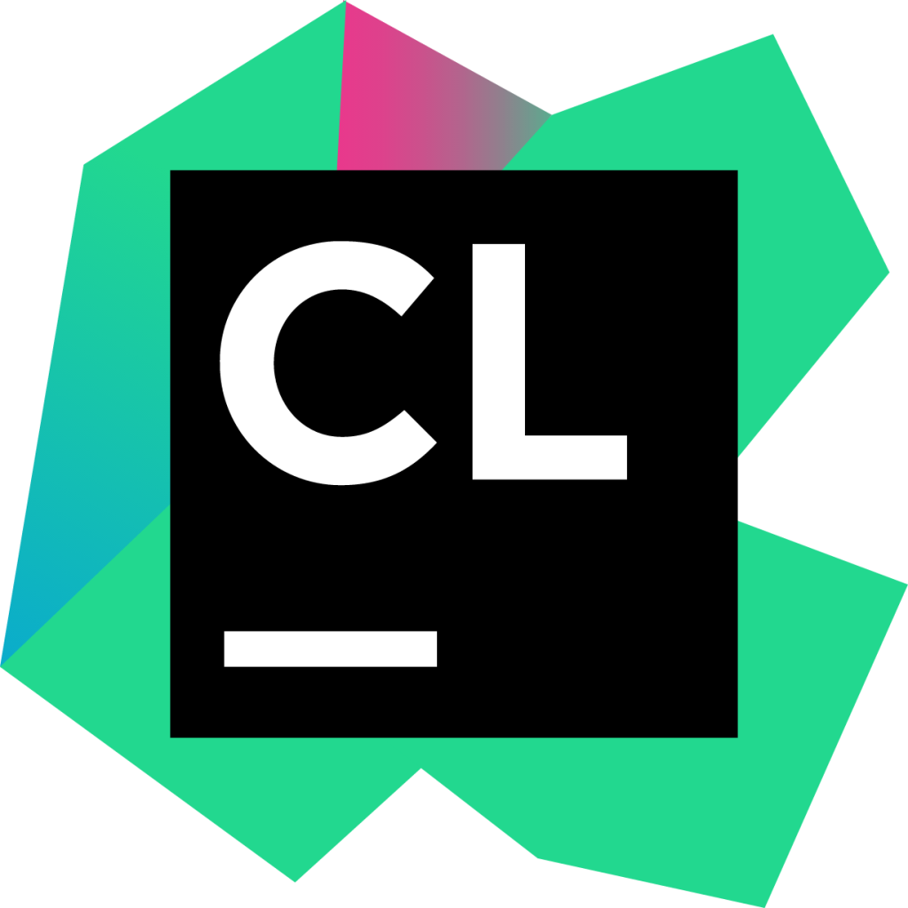
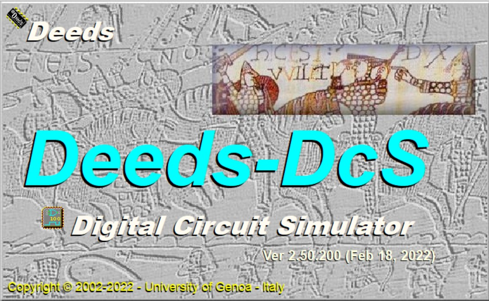

<h1 align="center">Hi guys👋, I'm LEE YIN SHEN</h1>

  

  <em>
    Myself <b>Lee Yin Shen</b>, a first year <b>Computer Science</b> undergraduate from <b>Universiti Teknologi Malaysia</b>.
    An aspiring <b>Data Engineer.</b> 
   
  <b><i>"---Its a difference of just one try between Success and Failure---"</i></b>

<h3>Little facts about me 🧑</h3>

- 🧞 A super introvert.
- 🏠 Enjoy to be alone.
- 🌴 A nature lover.
- 🎣 A fishing lover.
- 🔷 A Rubik's cube lover.

<h3>My skills 💪</h3>

- 

<h3>My study as a computer science(data engineering) student 👨‍🎓</h3>

<h4>Year 1</h4>

- Technology and Information System
  <h6>You can view my TIS projects here https://github.com/leeyinshen0818/Technology-and-Information-System-.git </h6>
- Digital Logic
  <h6>You can view my DL projects here https://github.com/leeyinshen0818/DIGITAL-LOGIC.git </h6>
- Programming Technique I
  <h6>You can view my PT1 projects here https://github.com/leeyinshen0818/PROGRAMMING-TECHNIQUE-I.git </h6>
- Discrete Structure
  <h6>You can view my DS projects here https://github.com/leeyinshen0818/DISCRETE-STRUCTURE.git </h6>

<h4> Languages and Tools I learned </h4>

<h4>Year 2</h4>

- to be continued...

<h4> Connect with me🤝: <h4>
  

  
  
  
   
    </a>
   
   

<!--
**leeyinshen0818/leeyinshen0818** is a ✨ _special_ ✨ repository because its `README.md` (this file) appears on your GitHub profile.

Here are some ideas to get you started:

- 🔭 I’m currently working on ...
- 🌱 I’m currently learning ...
- 👯 I’m looking to collaborate on ...
- 🤔 I’m looking for help with ...
- 💬 Ask me about ...
- 📫 How to reach me: ...
- 😄 Pronouns: ...
- ⚡ Fun fact: ...

- 👨‍💻 All of my projects are available at [https://github.com/leeyinshen0818/leeyinshen0818.git](https://github.com/leeyinshen0818/leeyinshen0818.git)
- 📫 How to reach me **leeyinshen2004@gmail.com**
- 🔭 I’m currently working on Fullstack Web Development, Native Mobile Development.
- 👯 I’m looking to collaborate with Fullstack Web and UI/UX projects.
- 💡 Contributing to Open Source Projects is always been a goal to me.
-->
